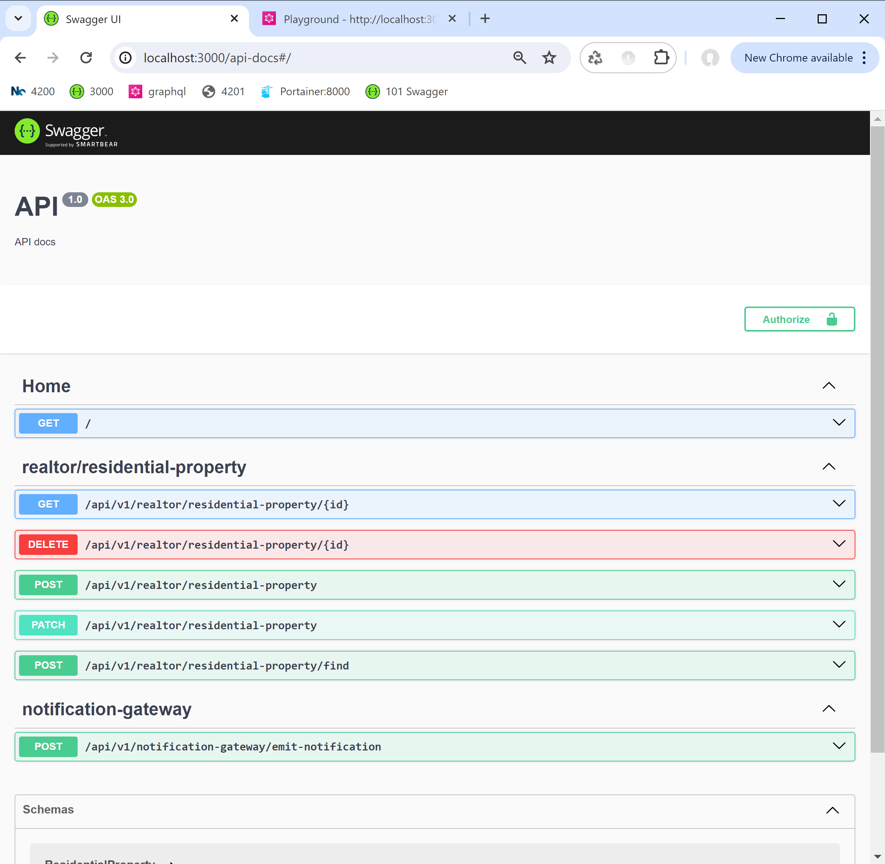
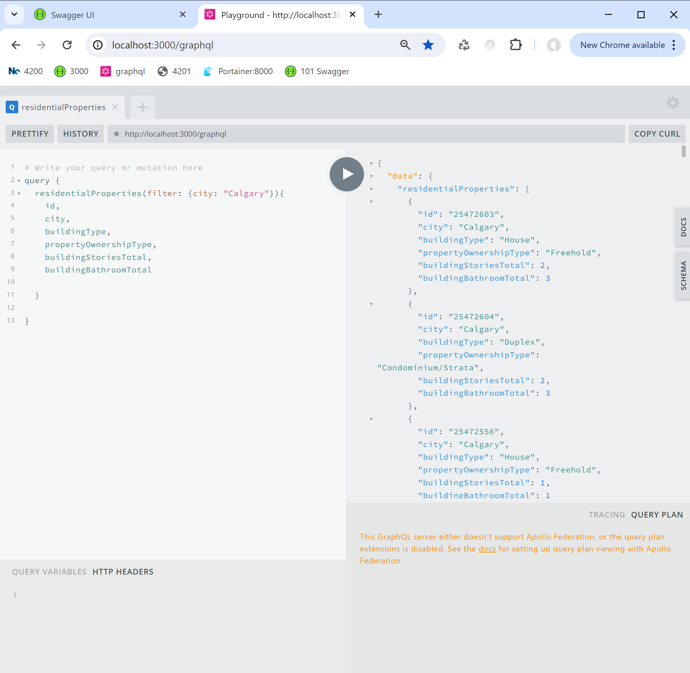

# dashboard starter backend

This is the backend Web API for the Dashboard Starter project in Angular. The frontend repository is available at:
https://github.com/j1032w/dashboard-starter

For the React.js edition, visit:
https://github.com/j1032w/das-mono-nestjs-reactjs








# Quick start with docker compose

1. Clone repository
```
git clone https://github.com/j1032w/dashboard-starter-data.git
```

2. Running docker compose
```
docker compose build
docker compose up -d
```

3. Restore database
```
mongorestore --drop  --gzip  -d das /database/das
```

4. Navigate to \
   API: http://localhost:3000/api-docs \
   GraphQL: http://localhost:3000/graphql


# Development
#### Modify .env file if needed


#### Start NestJS webapi server with debug, port: 3000
```
yarn start:debug:nodemon
``` 

#### Running unit tests
```
yarn test
```

#### Running eslint
```
yarn lint
```

#### Running build
``` 
yarn build
``` 
